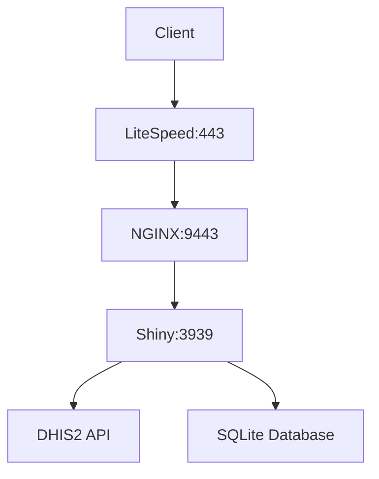

# DHIS2 HEAT+ Data Fetcher and Visualization Dashboard

## Table of Contents

1. [Overview](#overview)
2. [Technology Stack](#technology-stack)
3. [Prerequisites](#prerequisites)
4. [Repository Structure](#repository-structure)
5. [Deployment Guide](#deployment-guide)
   - [Host Server Setup](#host-server-setup)
   - [Container Deployment](#container-deployment)
   - [SSL Configuration](#ssl-configuration)
6. [Application Architecture](#application-architecture)
7. [Usage Guide](#usage-guide)
8. [Troubleshooting](#troubleshooting)
9. [Maintenance](#maintenance)

## Overview

The DHIS2 HEAT+ Dashboard is a comprehensive data visualization and analysis platform designed to fetch, process, and visualize health equity data from DHIS2 systems. The application provides:

- Secure authentication and user management
- Data fetching from DHIS2 instances
- Interactive visualizations including charts, maps, and tables
- Data cleaning and transformation tools
- Export capabilities to multiple formats

The system is containerized using Docker for easy deployment and scalability.

## Technology Stack


### Frontend

- **Shiny (R)**: Primary application framework
- **HTML/CSS/JavaScript**: UI components and styling
- **Plotly**: Interactive visualizations
- **Leaflet/Mapbox**: Geographic visualizations

### Backend

- **R**: Data processing and analysis
- **Shiny Server**: Application hosting
- **NGINX**: Reverse proxy and SSL termination
- **SQLite**: Local user database

### Infrastructure

- **Docker**: Containerization
- **Docker Compose**: Orchestration
- **LiteSpeed Web Server**: Host web server (optional)

### Supporting Libraries

- `shinydashboard`, `shinyWidgets`, `DT`, `httr`, `jsonlite`, `arrow`, `dplyr`, `ggplot2`

## Prerequisites

### Host Server Requirements

- Linux server (Ubuntu 20.04/22.04 recommended)
- Docker Engine (v20.10+)
- Docker Compose (v2.0+)
- Git
- SSL certificates (Let's Encrypt recommended)
- Minimum hardware:
  - 4 CPU cores
  - 8GB RAM
  - 50GB disk space

### Network Requirements

- Ports 80, 443, 3939, 8939, 9443 open
- Domain name with DNS configured

## Repository Structure

```
DHIS2HEAT/
├── app/                          # Shiny application
│   ├── db/                       # SQLite database directory
│   ├── dbackup/                  # Database backups
│   ├── fetched_data/             # Cached DHIS2 data
│   ├── module/                   # Shiny modules
│   ├── saved_setting/            # Application settings
│   ├── www/                      # Static assets
│   ├── app.R                     # Main application file
│   ├── server.R                  # Server logic
│   ├── ui.R                      # UI components
│   └── ...                       # Other R source files
├── nginx_app/                    # NGINX configuration
│   └── configuration/
│       ├── certs/                # SSL certificates
│       └── nginx/nginx.conf      # NGINX config
├── .env                          # Environment variables
├── docker-compose.yml            # Docker compose config
├── Dockerfile.shiny              # Shiny container build
├── init.deploy.sh                # Initial deployment script
├── shiny-server.conf             # Shiny server config
└── ...                           # Other configuration files
```

## Deployment Guide

### Host Server Setup

1. **Clone the repository**:

   ```bash
   git clone https://github.com/MIKEINTOSHSYSTEMS/DHIS2HEAT.git
   cd DHIS2HEAT
   ```

2. **Set up SSL certificates**:

   ```bash
   mkdir -p nginx_app/configuration/certs
   # Place your certs (fullchain.pem and privkey.pem) in the certs directory
   ```

3. **Configure environment variables**:
   Edit the `.env` file with your DHIS2 credentials:

   ```
   DHIS2_BASE_URL=https://your.dhis2.instance
   DHIS2_USERNAME=admin
   DHIS2_PASSWORD=district
   ```

### Container Deployment

1. **Build and start containers**:

   ```bash
   docker-compose -p dhis2heat up -d --build
   ```

2. **Verify containers are running**:

   ```bash
   docker-compose -p dhis2heat ps
   ```

3. **Initialize the application**:

   ```bash
   docker exec -it moheatpdhis2 /srv/shiny-server/init.deploy.sh
   ```

### SSL Configuration

1. **Configure your web server** (LiteSpeed example shown in original config):
   - Set up reverse proxy to forward traffic to NGINX (port 8939 for HTTP, 9443 for HTTPS)
   - Configure SSL termination at both LiteSpeed and NGINX levels

2. **Verify SSL**:

   ```bash
   curl -v https://heat.merqconsultancy.org:9443
   ```

## Application Architecture

### Container Interconnectivity



1. **Client** accesses `https://heat.merqconsultancy.org`
2. **LiteSpeed** handles SSL termination and forwards to NGINX
3. **NGINX** proxies requests to Shiny Server
4. **Shiny Server** serves the application and connects to:
   - DHIS2 API for data fetching
   - SQLite for user management

### Port Mapping

- 80: HTTP → 302 redirect to HTTPS
- 443: HTTPS (LiteSpeed)
- 3939: Shiny application port (internal)
- 8939: NGINX HTTP port (internal)
- 9443: NGINX HTTPS port (external)

## Usage Guide

### First-Time Setup

1. Access the application at `https://yourdomain.com`
2. Register an admin account (first user becomes admin)
3. Configure DHIS2 connection in Settings → Fetcher Setting
4. Save settings and fetch initial data

### Key Features

- **Data Preview**: View and filter fetched data
- **Visualizations**: Interactive charts and maps
- **Data Management**: Clean and transform datasets
- **User Management**: Create and manage user accounts
- **Export**: Download data in Excel or Parquet format

### Common Commands

**Restart services:**

```bash
docker-compose -p dhis2heat restart
```

**View logs:**

```bash
docker-compose -p dhis2heat logs -f
```

**Full cleanup:**

```bash
docker-compose -p dhis2heat down --volumes --rmi all
```

**Update application:**

```bash
git pull origin main
docker-compose -p dhis2heat up -d --build
```

## Troubleshooting

### Common Issues

**1. SSL Errors**

- Verify certificates are in `nginx_app/configuration/certs/`
- Check permissions on certificate files
- Ensure NGINX config points to correct cert paths

**2. Connection Timeouts**

- Verify DHIS2 credentials in `.env`
- Check network connectivity to DHIS2 instance
- Increase timeout values in NGINX config if needed

**3. Blank Dashboard**

- Check Shiny server logs: `docker logs moheatpdhis2`
- Verify data was fetched successfully
- Ensure required R packages are installed

### Log Locations

- Shiny Server: `docker logs moheatpdhis2`
- NGINX: `docker logs moheatpdhis2proxy`
- Application: `/srv/shiny-server/app/shiny_app_monitor.log`

## Maintenance

### Backup Procedures

1. **Database backup**:

   ```bash
   docker exec moheatpdhis2 sqlite3 /srv/shiny-server/app/db/data.sqlite ".backup '/srv/shiny-server/app/dbackup/backup.sqlite'"
   ```

2. **Data backup**:

   ```bash
   docker exec moheatpdhis2 tar czvf /srv/shiny-server/app/dbackup/data_$(date +%Y%m%d).tar.gz /srv/shiny-server/app/fetched_data/
   ```

### Update Procedure

1. Pull latest changes:

   ```bash
   git pull origin main
   ```

2. Rebuild containers:

   ```bash
   docker-compose -p dhis2heat up -d --build
   ```

3. Restart services:

   ```bash
   docker-compose -p dhis2heat restart
   ```

### Monitoring

- Set up monitoring for:
  - Container health
  - DHIS2 API response times
  - Disk space for data storage
  - Application logs for errors

---

This documentation provides a comprehensive guide to deploying and maintaining the DHIS2 HEAT+ Dashboard. For additional support, please open an issue on the GitHub repository.
